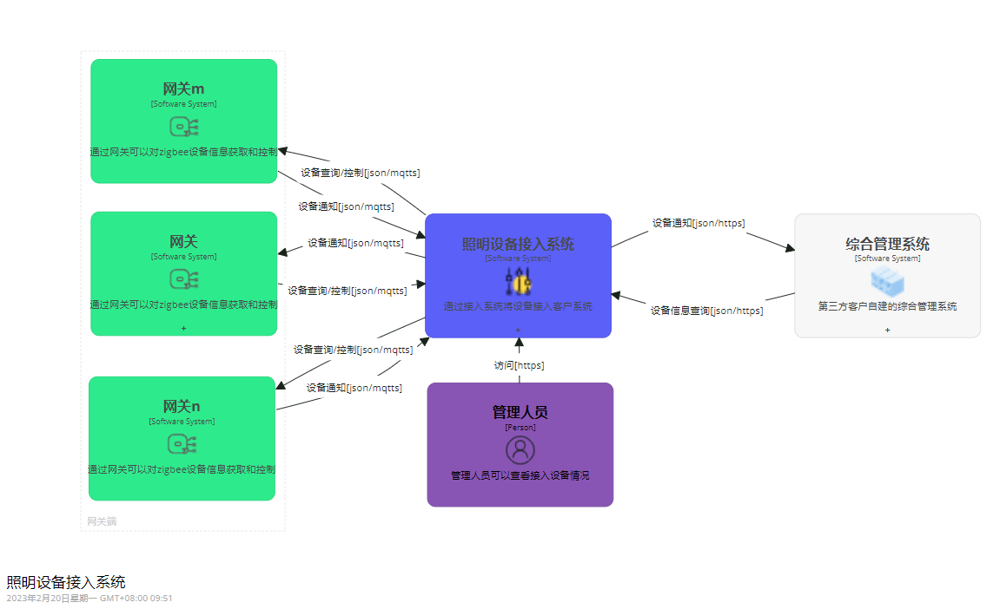
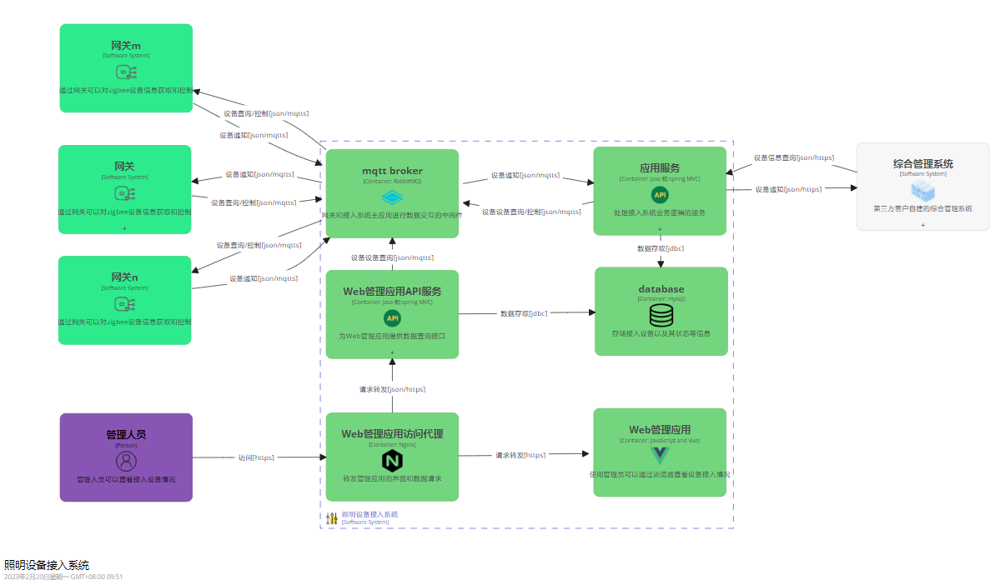
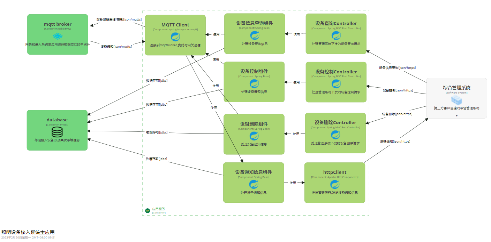
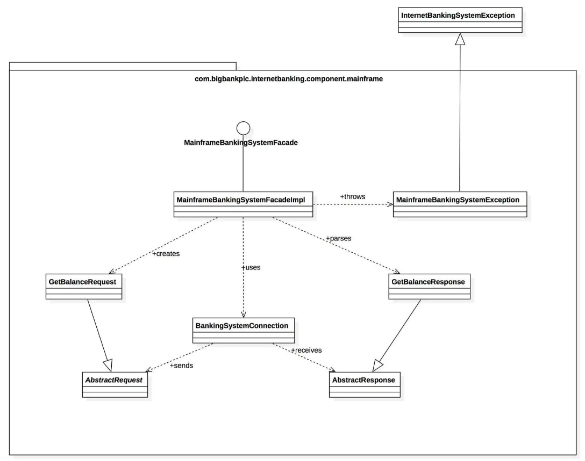
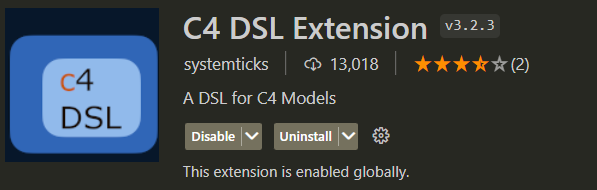
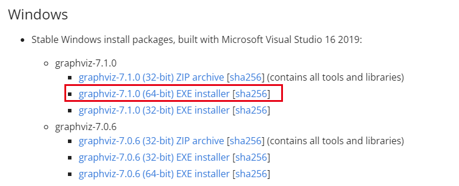
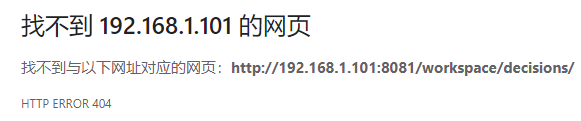
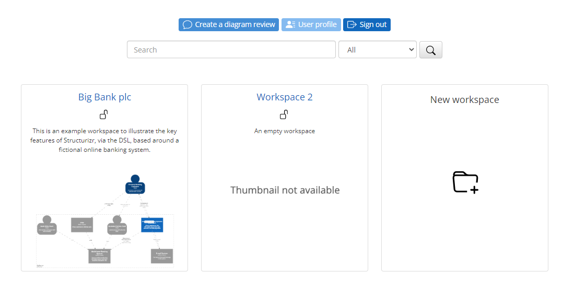
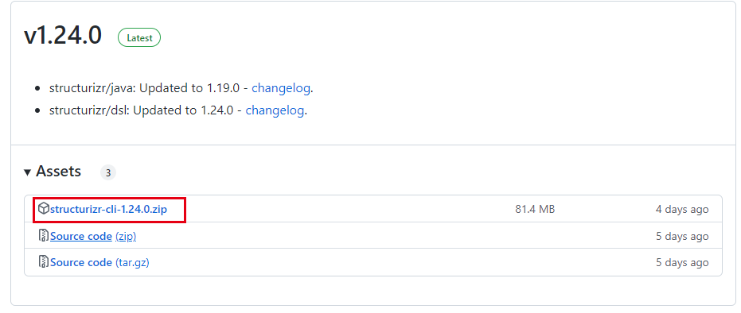

# C4概念介绍

官网：https://c4model.com/

C4模型提出者介绍连接https://www.infoq.cn/article/C4-architecture-model/

敏捷模式下架构图使用减少，手绘或者通用图表工具设计架构图容易出现含糊不清的情况。

C4模型是用来画软件架构图的。

C4模型有四张主图、和三张扩展图。

C4的四张主图面向不同类型的受众，图之间的关系是由大到小，由粗到细，由全局到局部的关系。


## 上下文图(**Context**)

​	描述正在构建的软件系统与用户以及与其他软件系统的关系。



## 容器图(**Container**)

​	容器图，将软件系统放大，显示组成该软件系统的容器（应用程序、数据存储、微服务等）



## 组件图(**Component**)

组件可以映射到代码库中的真实抽象（例如一组代码）



## 代码图(**Code**)

它表明该组件由很多类组成，实现细节直接反映了代码。不建议创建在这种详细程度的图表，有时候以直接从大多数IDE 中获取它们。



## 符号

C4 模型没有预定义任何特定的符号，你在这些示例图中看到的是一个个简单的符号，适用于白板、纸张、便签、索引卡片和各种图表工具。你也可以使用 UML 作为符号，并适当使用包、组件和原型。无论你使用哪种符号，我都会建议让每个元素都包含名称、元素类型（即“人”、“软件系统”，“容器”或“组件”）、技术选型（如果有的话），以及一些描述性文字。在图表中包含如此多的文本可能看起来很不寻常，但这些附加文本有助于消除软件架构图中通常会出现的不明确的表示。

即使符号对你来说是显而易见的，仍然要确保为这	些符号提供图例。图例中应该包括颜色、形状、首字母缩略词、线条样式、边框、尺寸等。理想情况下，符号应该在每个细节层次上保持一致。下面是前面显示的容器图的图例。

[](https://s3.amazonaws.com/infoq.content.live.0/articles/C4-architecture-model/zh/resources/508-1530372963198.jpg)

最后，不要忘记了标题，它应该出现在每个图表上，以明确地描述每个图表的类型和范围（例如，“网上银行系统的系统上下文图表”）。


# C4设计工具Structurizr

官网：https://structurizr.com/

## Structurizr DSL

### 编写工具

​	编写Structurizr DSL代码时使用的编辑工具为vs code，需要安装C4 DSL Extension插件。



​		该插件具有语法高亮显示，基本语义检查。介绍上还可以实时显示Structurizr DSL描述的图形，图形解析是外部共用服务解析的，需要将定义语言上传，一般不启用。该插件经常卡死，一般使用该插件Structurizr DSL语法高亮的功能。

### 语言解析

​	编写完Structurizr DSL后需要专门服务解析出图形。已知可以解析Structurizr DSL的工具或服务有：

​	c4viz:https://github.com/pmorch/c4viz

​	StructurizrSiteGeneratr:https://github.com/avisi-cloud/structurizr-site-generatr

​	Kroki:https://kroki.io/

​	Git for Confluence | Markdown, PlantUML, Graphviz, Mermaid:https://marketplace.atlassian.com/apps/1211675/git-for-confluence-markdown-plantuml-graphviz-mermaid?tab=overview&hosting=cloud

​	Structurizr on-premises:https://structurizr.com/help/on-premises

​	Structurizr cloud service:https://structurizr.com/help/cloud-service

​	**Structurizr Lite**:https://structurizr.com/help/lite

​	后续使用structurizr Lite进行Structurizr DSL的解析。

### 关于Structurizr DSL编写和调试

​	Structurizr Lite是一个java写的web应用，需要设置数据存储目录，也叫工作空间。在编写时vs code直接打开Structurizr Lite的工作空间目录，编写修改该目录下的xxx.dsl文件。编写结束后，直接保存，到Structurizr Lite刷新显示界面即可看到最新图标效果。

## Structurizr Lite

安装参考连接：https://structurizr.com/share/76352/documentation#installation

### Spring Boot启动包安装

```bash
java -jar structurizr-lite.war PATH
```

PATH为structurizr的数据目录，该目录自定义。

docker方式安装，参考上面的连接。

### 使用

#### 工作空间

structurizr启动会到数据目录(工作空间)下查找并加载workspace.dsl和workspace.json文件(没有会自动创建)。

#### STRUCTURIZR_WORKSPACE_PATH

​	工作空间可以使用环境变量配置统一的目录前缀。

#### 配置structurizr.properties

​	该文件需要手动在工作空间目录下创建。参数解析如下：

| 参数名                          | 解析                                                       |
| ------------------------------- | ---------------------------------------------------------- |
| structurizr.autoSaveInterval    | 自动保存设置，值单位为毫秒                                 |
| structurizr.autoRefreshInterval | 自动刷新设置，值单位为毫秒                                 |
| structurizr.remote.workspaceId  | 远程工作空间(cloud service或On-premises上的工作空间)ID，   |
| structurizr.remote.apiKey       | 远程工作空间apiKey                                         |
| structurizr.remote.apiSecret    | 远程工作空间apiSecret                                      |
| structurizr.remote.apiUrl       | 同步到On-premises服务对的地址，同步到cloud service不用设置 |
| structurizr.remote.passphrase   | 客户端密钥，用户加密工作空间数据。**付费功能**             |
| structurizr.editable            | 是否只读，false为只读。                                    |

#### 关于自动同步

​	如果配置了自动同步参数，structurizr-lite启动时会从远程更新workspace.json数据。完成编辑关闭structurizr-lite时会自动同步到远程工作空间。编辑时发现变动也会自动同步。

#### 工作空间锁定

​    structurizr-lite结合远程工作空间锁定使用，在启动structurizr-lite之前打开远程工作空间的锁定，并且保持远程界面不关闭。structurizr-lite需要从环境变量STRUCTURIZR_USERNAME中获取远程Structurizr 服务的用户登录名称。设置好之后就可以正常使用。

#### 常见问题

##### 系统启动后图片加载失败，或者界面变形。

​	在数据目录(workspace.dsl所在目录)创建(如果没有)structurizr.properties文件，并且添加参数structurizr.url=XXX，XXX为系统访问的根路径。

​	重启structurizr-lite。

##### 无法启动dot程序

​	需要安装Graphviz。

​	下载：https://graphviz.org/download/



​	安装时选择将graphviz添加到环境变量。

##### 图表手动调整后，再次打开调整效果丢失。

​	可能使被远程的自动布局效果给覆盖了。

##### 决策文档功能报404

http://192.168.1.101:8081/workspace/decisions/



暂未找到原因。正常界面：


## Structurizr 其他工具

​	使用Structurizr设计C4模式软甲架构图时，使用Structurizr Lite 配置VsCode的Structurizr  DSL插件即可。下面几个工具也Structurizr提供，这里简单的介绍下各工具的功能。

### Structurizr On-premises

参考:https://structurizr.com/share/18571/documentation

Structurizr Cloud service的本地版本，支持多用户使用，共享编辑同一个dsl文件。

on-premises程序为一个war包，直接放到tomcat运行即可。

启动  D:\PF\apache-tomcat-9.0.71\bin\startup.bat

访问  http://192.168.1.101:8080/



### Structurizr Cloud service

使用参考：https://structurizr.com/help/cloud-service/getting-started

Structurizr Cloud Service 和Structurizr On-promises功能类似，前者可以在快速体验功能时使用，只需注册一个帐号即可使用。Cloud Service 限制了只能一个workspace，超出要收费。实际使用时一般部署一个On-prosemises服务就可。

登录  https://structurizr.com/signin

### Structurizr CLI

参考连接:https://github.com/structurizr/cli

#### 本地安装

​	参考连接：https://github.com/structurizr/cli/blob/master/docs/local-installation.md

​	下载安装包：https://github.com/structurizr/cli/releases



​	下载后，解压到自定义目录，配置该目录到环境变量即可(可选)。

#### 使用

​	参考连接：https://github.com/structurizr/cli/blob/master/docs/getting-started.md

​	cli主要有两方面功能，一是将本地workspace内容同步到Structurizr Cloud Service或者Structurizr On-promises。二是将Structurizr DSL格式转换成其他格式，如：plantuml/c4plantuml/mermaid/dot等。

​	主要命令：

​		workspace 同步 

```bash
structurizr push -id WORKSPACE_ID -key KEY -secret SECRET -workspace workspace.dsl	
```

​	格式转换

```bash
structurizr export -workspace workspace.dsl -format plantuml
```

​		export命令参考：https://github.com/structurizr/cli/blob/master/docs/export.md


# 总结

好的：

​	结构清晰、负载足够多的信息，可以快速了解系统。

​	可以对比不同版本的差异，记录决策信息。

​	可以定位到不同系统或者容器的说明文档。

​	同一图例不会出现每个地方不一致的情况。

差的：

​	设计工具暂时还不太好用。

​	VsCode插件经常卡死，只能语法高亮，实时的图片生成和语义检测，基本无法使用。

​	对于复杂的图片自动排列功能无法得到想要的效果，而且存在组件名为中文是报错问题。