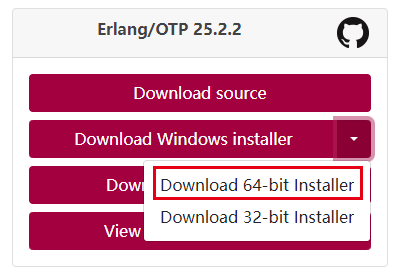
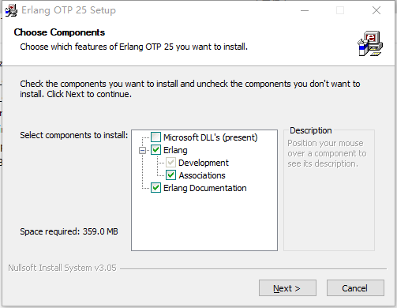
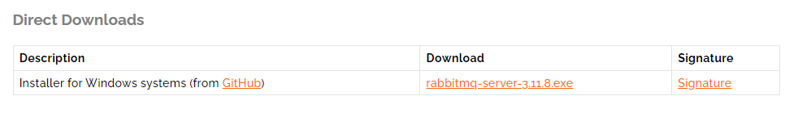
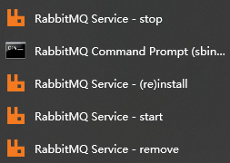
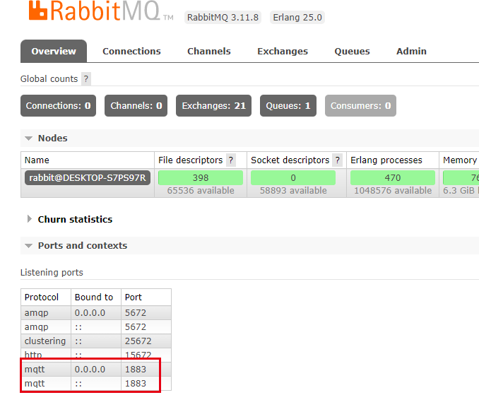
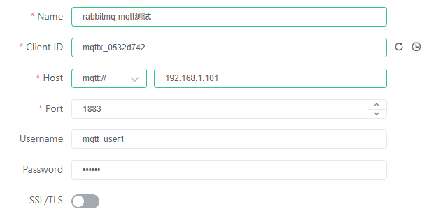
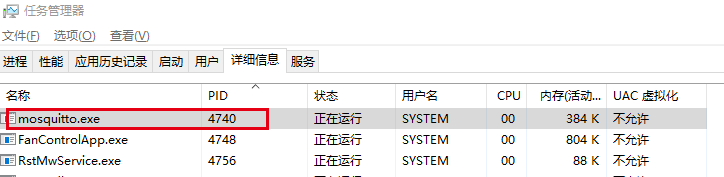

# windows安装

## 先安装erlang

下载：https://www.erlang.org/downloads



https://github.com/erlang/otp/releases/download/OTP-25.2.2/otp_win64_25.2.2.exe

安装，按照界面提示安装完成后，配置环境变量ERLANG_HOME=[D:\PF\Erlang OTP]

​	

## rebbitmq-server安装

下载安装包：

https://www.rabbitmq.com/install-windows.html



https://github.com/rabbitmq/rabbitmq-server/releases/download/v3.11.8/rabbitmq-server-3.11.8.exe

安装，按照界面提示安装完毕即可。


启停服务：在开始菜单找到以下菜单进行启停服务。



启用mqtt插件: 进入mqtt-server的安装目录sbin，通过菜单[RabbitMQ Command Prompt (sbin dir)]可以快速进入目录

管理界面访问  http://127.0.0.1:15672/  guest/guest

## 添加用户

rabbitmqctl    add_user mqtt_user1 123456

````
D:\PF\RabbitMQ Server\rabbitmq_server-3.11.8\sbin>rabbitmqctl    add_user mqtt_user1 123456
Adding user "mqtt_user1" ...
Done. Don't forget to grant the user permissions to some virtual hosts! See 'rabbitmqctl help set_permissions' to learn more.
````

rabbitmqctl set_user_tags mqtt_user1 management

````
D:\PF\RabbitMQ Server\rabbitmq_server-3.11.8\sbin>rabbitmqctl set_user_tags mqtt_user1 management
Setting tags for user "mqtt_user1" to [management] ...
````

## 添加vhost

rabbitmqctl add_vhost vhost_mqtt

````
D:\PF\RabbitMQ Server\rabbitmq_server-3.11.8\sbin>rabbitmqctl add_vhost vhost_mqtt
Adding vhost "vhost_mqtt" ...
````

## 用户授权

rabbitmqctl set_permissions -p vhost_mqtt  mqtt_user1 ".*" ".*" ".*"

````
D:\PF\RabbitMQ Server\rabbitmq_server-3.11.8\sbin>rabbitmqctl set_permissions -p vhost_mqtt  mqtt_user1 ".*" ".*" ".*"
Setting permissions for user "mqtt_user1" in vhost "vhost_mqtt" ...
````

````
D:\PF\RabbitMQ Server\rabbitmq_server-3.11.8\sbin>rabbitmqctl set_permissions -p  /  mqtt_user1 ".*" ".*" ".*"
Setting permissions for user "mqtt_user1" in vhost "/" ...
````

## rabbitmq服务tls配置

参考连接：https://www.rabbitmq.com/ssl.html#erlang-otp-requirements

### 启用插件rabbitmq_auth_mechanism_ssl

查看插件启停状态

rabbitmq-plugins list

````
D:\PF\RabbitMQ Server\rabbitmq_server-3.11.8\sbin>rabbitmq-plugins list
Listing plugins with pattern ".*" ...
 Configured: E = explicitly enabled; e = implicitly enabled
 | Status: * = running on rabbit@DESKTOP-S7PS97R
 |/
[  ] rabbitmq_amqp1_0                  3.11.8
[  ] rabbitmq_auth_backend_cache       3.11.8
[  ] rabbitmq_auth_backend_http        3.11.8
[  ] rabbitmq_auth_backend_ldap        3.11.8
[  ] rabbitmq_auth_backend_oauth2      3.11.8
[  ] rabbitmq_auth_mechanism_ssl       3.11.8
[  ] rabbitmq_consistent_hash_exchange 3.11.8
[  ] rabbitmq_event_exchange           3.11.8
[  ] rabbitmq_federation               3.11.8
[  ] rabbitmq_federation_management    3.11.8
[  ] rabbitmq_jms_topic_exchange       3.11.8
[E*] rabbitmq_management               3.11.8
[e*] rabbitmq_management_agent         3.11.8
[E*] rabbitmq_mqtt                     3.11.8
[  ] rabbitmq_peer_discovery_aws       3.11.8
[  ] rabbitmq_peer_discovery_common    3.11.8
[  ] rabbitmq_peer_discovery_consul    3.11.8
[  ] rabbitmq_peer_discovery_etcd      3.11.8
[  ] rabbitmq_peer_discovery_k8s       3.11.8
[  ] rabbitmq_prometheus               3.11.8
[  ] rabbitmq_random_exchange          3.11.8
[  ] rabbitmq_recent_history_exchange  3.11.8
[  ] rabbitmq_sharding                 3.11.8
[  ] rabbitmq_shovel                   3.11.8
[  ] rabbitmq_shovel_management        3.11.8
[  ] rabbitmq_stomp                    3.11.8
[  ] rabbitmq_stream                   3.11.8
[  ] rabbitmq_stream_management        3.11.8
[  ] rabbitmq_top                      3.11.8
[  ] rabbitmq_tracing                  3.11.8
[  ] rabbitmq_trust_store              3.11.8
[e*] rabbitmq_web_dispatch             3.11.8
[E*] rabbitmq_web_mqtt                 3.11.8
[  ] rabbitmq_web_mqtt_examples        3.11.8
[  ] rabbitmq_web_stomp                3.11.8
[  ] rabbitmq_web_stomp_examples       3.11.8
````

启用rabbitmq_auth_mechanism_ssl插件

rabbitmq-plugins enable rabbitmq_auth_mechanism_ssl

````
D:\PF\RabbitMQ Server\rabbitmq_server-3.11.8\sbin>rabbitmq-plugins enable rabbitmq_auth_mechanism_ssl
Enabling plugins on node rabbit@DESKTOP-S7PS97R:
rabbitmq_auth_mechanism_ssl
The following plugins have been configured:
  rabbitmq_auth_mechanism_ssl
  rabbitmq_management
  rabbitmq_management_agent
  rabbitmq_mqtt
  rabbitmq_web_dispatch
  rabbitmq_web_mqtt
Applying plugin configuration to rabbit@DESKTOP-S7PS97R...
The following plugins have been enabled:
  rabbitmq_auth_mechanism_ssl

started 1 plugins.
````

### tls-gen工具生成ssl证书

​	git clone https://github.com/michaelklishin/tls-gen tls-gen 

​	 cd tls-gen/basic 

 	private key password 

​	 make PASSWORD=密码  

​	 make verify 

​	 make info 

​	 ls  ./result

````
[root@192 basic]# ll ./result/
total 32
-rw-r--r-- 1 root root 1281 Feb  9 17:39 ca_certificate.pem
-rw------- 1 root root 1854 Feb  9 17:39 ca_key.pem
-rw-r--r-- 1 root root 1285 Feb  9 17:39 client_192.168.1.102_certificate.pem
-rw------- 1 root root 1874 Feb  9 17:39 client_192.168.1.102_key.pem
-rw------- 1 root root 3461 Feb  9 17:39 client_192.168.1.102.p12
-rw-r--r-- 1 root root 1371 Feb  9 17:39 server_192.168.1.102_certificate.pem
-rw------- 1 root root 1874 Feb  9 17:39 server_192.168.1.102_key.pem
-rw------- 1 root root 3525 Feb  9 17:39 server_192.168.1.102.p12
````

client_192.168.1.102_key.pem 为带密码的pkcs8格式密钥，提取出不带密码的pkcs1格式密钥：

````
C:\Users\vghnjghvn\AppData\Roaming\RabbitMQ\tls-certs>openssl rsa -in client_Access_key.pem -out client_Access_key.pem.pkcs1.pem
Enter pass phrase for client_192.168.1.102_key.pem:
writing RSA key
````

### openssl 生成自签证书

````
openssl req -x509 -sha256 -days 3560 -nodes -newkey rsa:2048 -subj  "/CN=Access service/C=CN/L=ZheJiang" -keyout AccessService.key -out AccessService.crt
````

````
openssl req -x509 -sha256 -days 3560 -nodes -newkey rsa:2048 -subj  "/CN=Access client/C=CN/L=ZheJiang" -keyout AccessClient.key -out AccessClient.crt
````

一级自签证书直接配置在rabbitmq上，验证失败。

### rabbitmq.conf增加tls配置

C:\Users\vghnjghvn\AppData\Roaming\RabbitMQ\rabbitmq.conf

````
listeners.ssl.default = 5671
ssl_options.cacertfile = C:/Users/vghnjghvn/Desktop/result/ca_certificate.pem
ssl_options.certfile = C:/Users/vghnjghvn/Desktop/result/server_192.168.1.102_certificate.pem
ssl_options.keyfile = C:/Users/vghnjghvn/Desktop/result/server_192.168.1.102_key.pem
ssl_options.verify = verify_peer
ssl_options.fail_if_no_peer_cert = true
ssl_options.password = 123456
````

## 启用mqtt插件

​	输入命令    rabbitmq-plugins enable rabbitmq_mqtt

````
D:\PF\RabbitMQ Server\rabbitmq_server-3.11.8\sbin>rabbitmq-plugins enable rabbitmq_mqtt
Enabling plugins on node rabbit@DESKTOP-S7PS97R:
rabbitmq_mqtt
The following plugins have been configured:
  rabbitmq_management
  rabbitmq_management_agent
  rabbitmq_mqtt
  rabbitmq_web_dispatch
Applying plugin configuration to rabbit@DESKTOP-S7PS97R...
Plugin configuration unchanged.
````

​	重启rabbitmq服务，管理端界面可以直接看到mqtt协议服务已起。



## 启用web_mqtt插件

该插件支持websocket使用mqtt协议进行访问。

**rabbitmq-plugins** **enable rabbitmq_web_mqtt**

````
D:\PF\RabbitMQ Server\rabbitmq_server-3.11.8\sbin>rabbitmq-plugins enable rabbitmq_web_mqtt
Enabling plugins on node rabbit@DESKTOP-S7PS97R:
rabbitmq_web_mqtt
The following plugins have been configured:
  rabbitmq_management
  rabbitmq_management_agent
  rabbitmq_mqtt
  rabbitmq_web_dispatch
  rabbitmq_web_mqtt
Applying plugin configuration to rabbit@DESKTOP-S7PS97R...
The following plugins have been enabled:
  rabbitmq_web_mqtt

started 1 plugins.
````


## mqtt客户端连接



用户名： 如果需要成功连接需要给用户分配连接的vhost的权限。vhost默认连接“/”，还不知道如何修改。

​				指定连接vhost时签名加上vhost名称，用冒号分割。例：**vhost_mqtt:mqtt_user1**

## mqtt服务tls配置

​			


## 问题

### 	rabbitmqctl命令执行失败

````
D:\PF\RabbitMQ Server\rabbitmq_server-3.11.8\sbin>rabbitmqctl    add_user mqtt_user1 123456
Error: unable to perform an operation on node 'rabbit@DESKTOP-S7PS97R'. Please see diagnostics information and suggestions below.

Most common reasons for this are:

 * Target node is unreachable (e.g. due to hostname resolution, TCP connection or firewall issues)
 * CLI tool fails to authenticate with the server (e.g. due to CLI tool's Erlang cookie not matching that of the server)
 * Target node is not running

In addition to the diagnostics info below:

 * See the CLI, clustering and networking guides on https://rabbitmq.com/documentation.html to learn more
 * Consult server logs on node rabbit@DESKTOP-S7PS97R
 * If target node is configured to use long node names, don't forget to use --longnames with CLI tools
````

解决方法：

​	将C:\Users\vghnjghvn\\.erlang.cookie文件覆盖C:\Windows\System32\config\systemprofile\\.erlang.cookie文件。vghnjghvn为当前的系统用户名。重启rabbitmq服务。

​	如果发现C:\Windows\System32\config\systemprofile目录无法进入，重启windows的资源管理器。

### mqtt插件安装后，重启服务失败

重启rabbitmq-server服务，重启过程中报错,应该是端口占用。

````
Error during startup: {error,
                       {rabbitmq_mqtt,
                        {{shutdown,
                          {failed_to_start_child,
                           'rabbit_mqtt_listener_sup_:::1883',
                           {shutdown,
                            {failed_to_start_child,
                             {ranch_embedded_sup,
                              {acceptor,{0,0,0,0,0,0,0,0},1883}},
                             {shutdown,
                              {failed_to_start_child,
                               {ranch_listener_sup,
                                {acceptor,{0,0,0,0,0,0,0,0},1883}},
                               {shutdown,
                                {failed_to_start_child,ranch_acceptors_sup,
                                 {listen_error,
                                  {acceptor,{0,0,0,0,0,0,0,0},1883},
                                  eacces}}}}}}}}},
                         {rabbit_mqtt,start,[normal,[]]}}}}
````

windows查看端口占用程序。

````
D:\PF\RabbitMQ Server\rabbitmq_server-3.11.8\sbin>netstat -ano|findstr 1883
  TCP    0.0.0.0:1883           0.0.0.0:0              LISTENING       4740
  TCP    [::]:1883              [::]:0                 LISTENING       4740
````

任务管理器查看 4740 程序



关掉该服务即可。

成功重启rabbitmq。

````
D:\PF\RabbitMQ Server\rabbitmq_server-3.11.8\sbin>rabbitmq-server
2023-02-09 12:08:16.354000+08:00 [warning] <0.130.0> Using RABBITMQ_ADVANCED_CONFIG_FILE: c:/Users/vghnjghvn/AppData/Roaming/RabbitMQ/advanced.config
2023-02-09 12:08:18.676000+08:00 [notice] <0.44.0> Application syslog exited with reason: stopped
2023-02-09 12:08:18.676000+08:00 [notice] <0.229.0> Logging: switching to configured handler(s); following messages may not be visible in this log output

  ##  ##      RabbitMQ 3.11.8
  ##  ##
  ##########  Copyright (c) 2007-2023 VMware, Inc. or its affiliates.
  ######  ##
  ##########  Licensed under the MPL 2.0. Website: https://rabbitmq.com

  Erlang:      25.0 [jit]
  TLS Library: OpenSSL - OpenSSL 1.1.1d  10 Sep 2019
  Release series support status: supported

  Doc guides:  https://rabbitmq.com/documentation.html
  Support:     https://rabbitmq.com/contact.html
  Tutorials:   https://rabbitmq.com/getstarted.html
  Monitoring:  https://rabbitmq.com/monitoring.html

  Logs: <stdout>
        c:/Users/vghnjghvn/AppData/Roaming/RabbitMQ/log/rabbit@DESKTOP-S7PS97R.log
        c:/Users/vghnjghvn/AppData/Roaming/RabbitMQ/log/rabbit@DESKTOP-S7PS97R_upgrade.log

  Config file(s): c:/Users/vghnjghvn/AppData/Roaming/RabbitMQ/advanced.config

  Starting broker... completed with 4 plugins.
````


