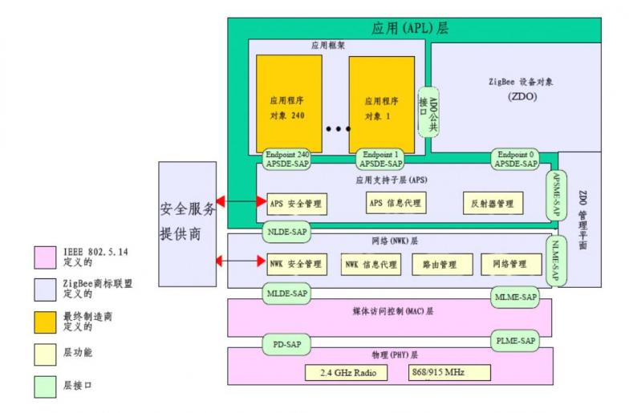

# zigbee协议栈整体架构

​	zigbee协议栈包括四层，分别为物理层、MAC层、网络层、应用层。外加安全服务、ADO管理层。

应用层分为应用支持子层、应用框架、zigbee设备对象。

物理层和MAC层有IEEE 802.4.14定义，安全服务由安全服务商提供。

zigbee网络拓扑可以分为星形、树形、网格形。

# zigbee协议文档缩写解析

FFD ：全功能设备

FSK：信息传输中的一种调制方式

GB ：Great Britain

GHz ：千兆赫

GPD ：低功耗设备

GPDF ：低功耗设备框架

GPEP ：低功耗EP

GTS ：Guaranteed time slot

HDR ：Header

IB ：信息库

IE ：信息元

IEEE ：电气与电子工程师协会

kHz ：千赫兹

LBT ：Listen Before Talk。ETSI定义的信道访问机制

LQI ：链路质量

LR-WPAN ：低速无线个域网

MAC ：媒介访问控制

MCPS-SAP ：介质访问控制公共部分子层服务接入点

MHz ：兆赫兹

MIC ：信息完整性检测码

MLME-SAP ：介质访问控制子层管理实体服务接入点

MR-FSK ：多速率和多区域频移键控zigbee规范

MSC ：消息序列图

MSDU ：介质访问控制子层服务数据单元

MSG ：报文

NBDT ：网络广播时间

NHLE ：下一个更高层实体

NIB ：网络层信息库

NLDE ：网络层数据实体

NLDE-SAP ：网络层数据实体服务接入点

NLME ：网络层管理实体

NLME-SAP：网络层管理实体服务接入点

NPDU ：网络层协议数据单元

NSDU ：网络服务数据单元

NWK ：网络

OSI ：开发互联系统

PAN ：个人区域网络

PD-SAP ：物理层数据服务接入点

PDU ：协议数据单元

PHR ：PHY Header

PHY ：物理层

PIB ：个人区域网信息库

PLME-SAP ：物理层管理实体–服务接入点

POS ：Personal operating spacezigbee Specification 

PPDU ：物理层协议数据单元

PSDU :物理层数据单元

QOS ：服务质量

RFD ：简化功能设备

RREP：路由应答 

RREQ ：路由请求

RN ：路由节点

SAP ：服务访问点

SFD ：帧起始定界符

SHR ：Synchronization Header

SKG ：密钥生成

SSP ：安全服务提供商

SSS ：安全服务规范

TRD ：技术要点

WPAN ：无线个人网

XML ：可扩展标识语言

ZB ：ZigBee

ZDO ：ZigBee设备对象

