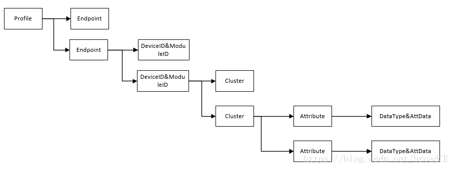
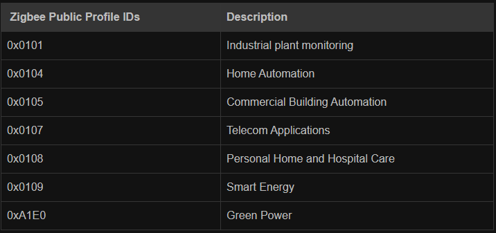
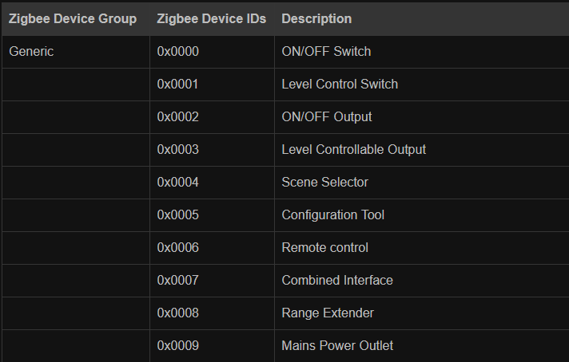
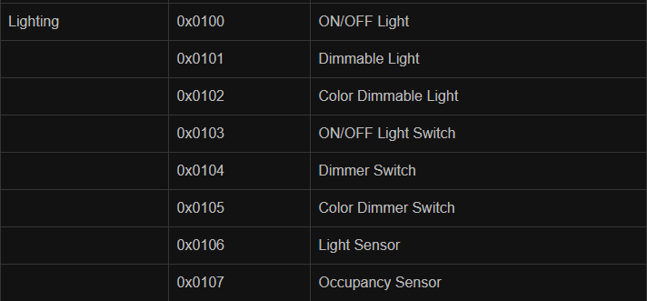
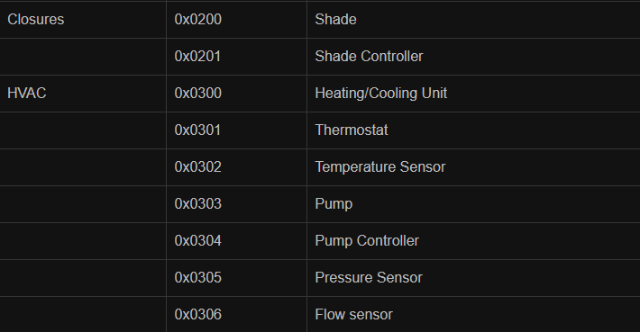
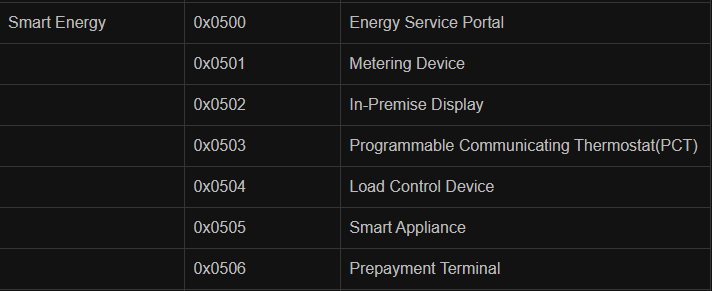
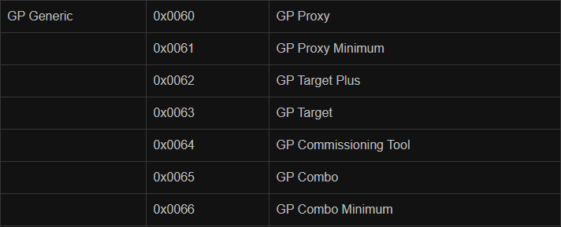

https://blog.csdn.net/broadce/article/details/80154221

​																			**ZigBee ProfileID，DeviceID，ClusterID**

ProfileID

DeviceID

Following table mentions Zigbee DeviceIDs. These IDs range from 0x0000 to 0xFFFF. The IDs in the table are used inHome Automation Profile of zigbee.

 Cluster 

• Zigbee Cluster IDs 0x0000to 0x7FFF - It is used as zigbee standard cluster

• Zigbee Cluster IDs 0x8000to 0xFBFF - reserved for future

• Zigbee Cluster IDs 0xFC00to 0xFFFF - Manufacturer specific